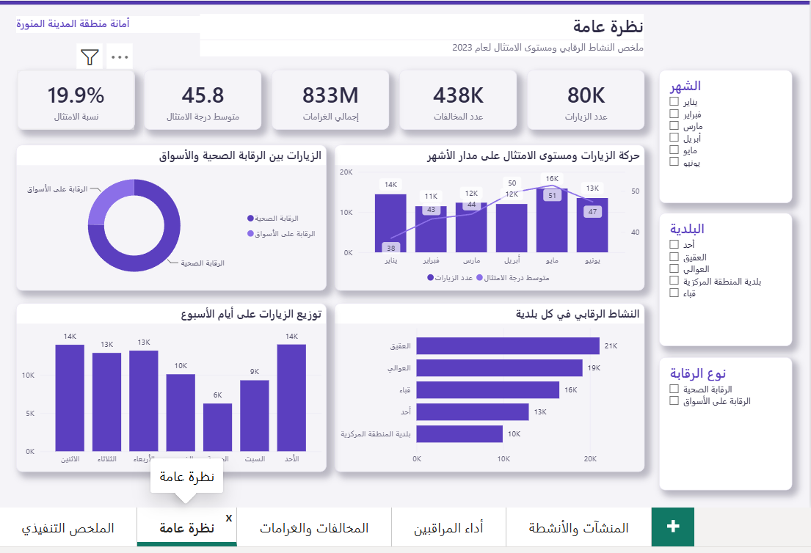
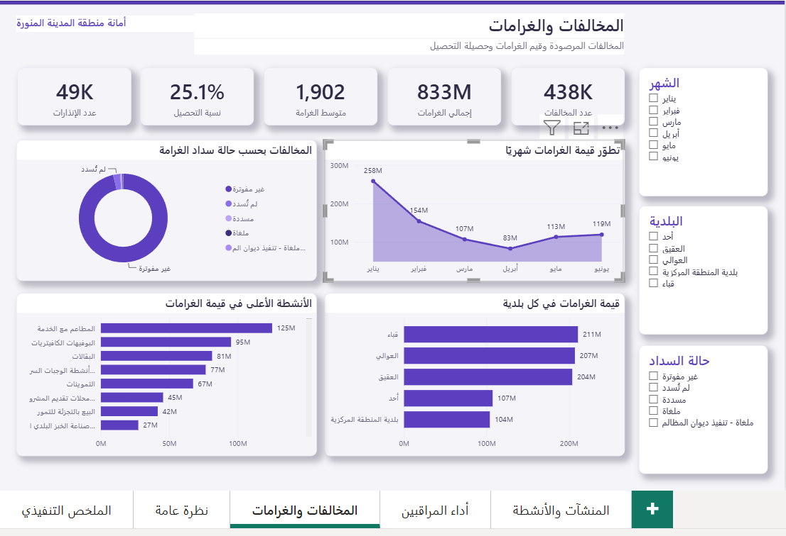
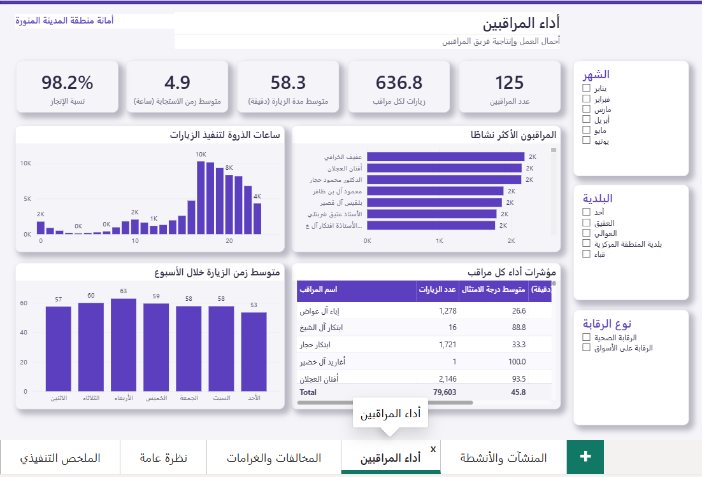
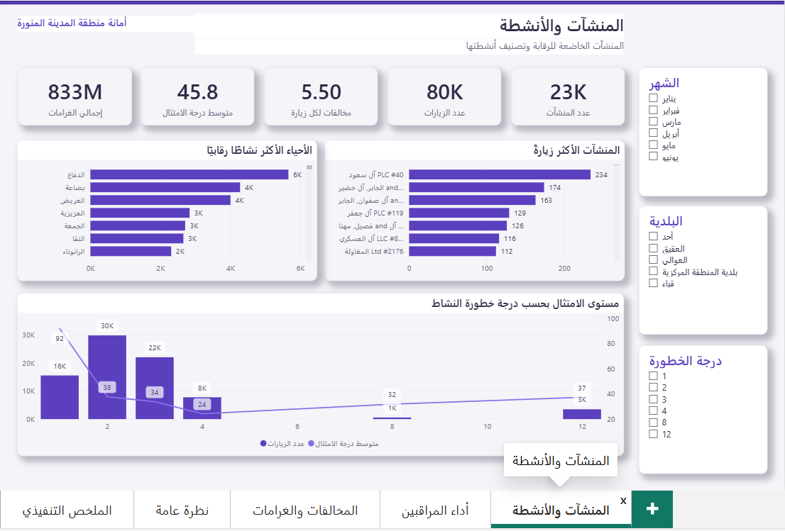

<b>العربية</b> · <a href="#english-version">English</a>

# لوحة الزيارات الرقابية — أمانة منطقة المدينة المنورة

لوحة Power BI تفاعلية تحلّل الزيارات الرقابية لأمانة منطقة المدينة المنورة في النصف الأول من 2023، نحو 80 ألف زيارة و438 ألف مخالفة، وتحوّلها إلى صورة واضحة تدعم قرارات الرقابة والتحصيل.

*بيانات المشروع محاكاة لأغراض العرض وليست بيانات حقيقية، والأرقام توضيحية.*

## أبرز النتائج

الامتثال العام لا يتجاوز 19.9%، ويظل ثابتًا طوال الأشهر الستة دون تحسّن يُذكر. ويتراجع الالتزام كلما ارتفعت خطورة النشاط، فالأنشطة الأعلى خطورة تسجّل امتثالًا قرب 6% مقابل نحو 50% للأدنى. أما قطاع الأغذية فهو الأضعف، إذ تبلغ مخالفات التموينات 96% والبقالة 95%.

الخلل الأبرز يكمن في التحصيل: 2.8% فقط من إجمالي الغرامات (833 مليون ريال) جرت فوترته فعليًا، ولم يُحصَّل منه سوى جزء يسير. وتتركّز الغرامات زمنيًا في يناير الذي يستحوذ على 31% من غرامات النصف الأول، وجغرافيًا في بلديات قباء والعوالي والعقيق.

تشير هذه المؤشرات إلى ثلاث أولويات: معالجة خط الفوترة أولًا، ثم ربط كثافة التفتيش بدرجة الخطورة، ثم إطلاق حملة تفتيش وتوعية موجّهة لقطاع الأغذية.

## كيف بُنيت

جاء المصدر ملف إكسل بورقتين على مستويين مختلفين (الزيارة والمخالفة)، فأعدت هيكلته في نموذج نجمي يفصل الحقائق عن الأبعاد: جدولا حقائق (الزيارات والمخالفات) وستة أبعاد هي التاريخ والمنشأة والنشاط والموقع والمراقب، مع 23 مقياس DAX وست علاقات نشطة.

أهم قرار في التحليل كان احتساب الغرامات من مستوى المخالفة لا مستوى الزيارة، فالخلط بينهما يعطي 109 مليون ريال بدل 833 مليون، وهو فارق يقلب كل استنتاج لاحق.

## الصفحات

خمس صفحات تتدرّج من العام إلى التفصيلي: ملخص تنفيذي، ونظرة عامة، والمخالفات والغرامات، وأداء المراقبين، والمنشآت والأنشطة. التصميم عربي (RTL) بثيم موحّد، مع عناوين بيانات على الرسوم وترتيب زمني للأشهر وأيام الأسبوع.

**المخالفات والغرامات**

**أداء المراقبين**

**المنشآت والأنشطة**

## التشغيل

افتح `visits_dashboard.pbip` في Power BI Desktop، وستُحمَّل البيانات من مجلد `data/`. اضغط Refresh عند أول فتح، وإن ظهر خيار ترقية صيغة التقرير فاختر Don't upgrade.

## الأدوات

Power BI، وDAX، وPower Query، ونمذجة نجمية، وPython.

---

<a href="#لوحة-الزيارات-الرقابية--أمانة-منطقة-المدينة-المنورة">العربية</a> · <b>English</b>

# Madinah Municipality — Inspection Visits Dashboard

An interactive Power BI dashboard that analyzes regulatory inspection visits for the Madinah Region Municipality across the first half of 2023, about 80,000 visits and 438,000 violations, turning them into a clear picture that supports enforcement and collection decisions.

*The project uses simulated, non-real data for demonstration; the figures are illustrative.*

## Key findings

Overall compliance does not exceed 19.9%, and it stays flat across all six months with no real improvement. Compliance also drops as activity risk rises, with the highest-risk activities sitting near 6% against roughly 50% for the lowest. Food retail is the weakest area, with convenience stores at 96% violations and groceries at 95%.

The clearest gap is in collection: only 2.8% of total fines (SAR 833M) were actually invoiced, and only a small part of that was ever collected. Fines concentrate in January, which accounts for 31% of first-half fines, and geographically in the Quba, Al-Awali, and Al-Aqiq municipalities.

Together these point to three priorities: fix the invoicing pipeline first, then tie inspection frequency to risk level, then run a targeted campaign for the food sector.

## How it was built

The source was an Excel workbook with two sheets at different grains (visit and violation), which I restructured into a star schema separating facts from dimensions: two fact tables (visits and violations) and six dimensions, namely date, establishment, activity, location, and inspector, with 23 DAX measures and six active relationships.

The key analytical decision was reading fines from the violation grain rather than the visit grain, since mixing the two returns SAR 109M instead of 833M, a gap that flips every downstream conclusion.

## Pages

Five pages that move from overview to detail: an executive summary, an overview, violations and fines, inspector performance, and establishments and activities. The design is Arabic (RTL) with a consistent theme, data labels on the charts, and chronological ordering for months and weekdays.

## Running it

Open `visits_dashboard.pbip` in Power BI Desktop, and the data will load from the `data/` folder. Click Refresh on first open, and if prompted to upgrade the report format, choose Don't upgrade.

## Tools

Power BI, DAX, Power Query, star-schema modeling, and Python.
